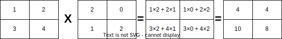
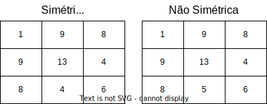
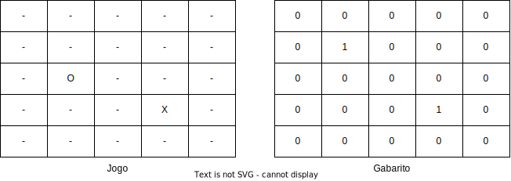

# Lista de Matriz

## **Prazos**

- Primeiro prazo: 10/05/2024
- Segundo prazo: 17/05/2024

---

# 01 (*Fácil*)
## Enunciado:
Escreva um programa em C que receba uma matriz 3x3 como entrada e exiba a soma de todos os elementos.

## Entrada:
```
1 2 3
4 5 6
7 8 9
```

## Saida:
```
Soma dos elementos: 45
```

---

# 02 (*Fácil*)
## Enunciado:
Escreva um programa em C que receba uma matriz (2x3) e retorne a transposta (3x2) dessa matriz.

## Entrada:
```
1 2
3 4
5 6
```

## Saida:
```
1 3 5
2 4 6
```

----

# 03 (*Fácil*)
## Enunciado:
Escreva um programa em C que receba uma matriz de tamanho 3x3 e exiba apenas as bordas da matriz.

## Entrada:
```
1 2 3
4 5 6
7 8 9
```

## Saida:
```
1 2 3
4   6
7 8 9
```

---

# 04 (*Fácil*)
## Enunciado:
Escreva um programa em C que encontre o elemento mínimo e máximo de uma matriz.

## Entrada:
```
1 2 3
4 5 6
7 8 9
```

## Saida:
```
Elemento mínimo: 1
Elemento máximo: 9
```

---


# 05 (*Médio*)
## Enunciado:
Escreva um programa em C que multiplique duas matrizes quadradas de ordem 2 e retorne o resultado.

### Dica:


## Entrada:
```
1 2
3 4

2 0
1 2
```

## Saida:
```
4 4
10 8
```

---


# 06 (*Médio*)
## Enunciado:
Escreva um programa em C que compare duas matrizes de mesma ordem e verifique se são idênticas.

## Entrada:

```
3 4 8
5 6 2
1 7 0
```

```
3 4 8
5 6 2
1 7 0
```

## Saida:

```
As matrizes são idênticas
```

---


# 07 (*Médio*)
## Enunciado:
Escreva um programa em C que verifique se uma matriz é simétrica ou não.

### Dica:

Uma matriz simétrica é uma matriz quadrada em que `a[i][j] == a[j][i]` para todo `i` e todo `j`.

## Entrada:



---

# 08 (*Difícil*)
## Enunciado:
Implemente uma versão simplificada do clássico jogo de tabuleiro Batalha Naval. Use uma matriz (5x5) para representar o tabuleiro, onde cada célula pode conter um navio ou ser vazia. Os jogadores devem tentar adivinhar a localização de 2 navios (Solicite que usuário informa a posição) do oponente até que todos sejam encontrados.

### Dica:



- `O` tiro na aguá.
- `X` tiro acertou o navio.
- `-` area que ainda não foi escolhida.
- Verificar se o palpite não vai sair fora do tabuleiro

## Entrada:

- Solicite que o usuário informe onde estão os 2 navios (X Y).
- Após isso se desejar limpar a tela utilize o comando `system("clear")` para Linux ou `system("cls")` para Windows, não esqueça de importar a biblioteca `<stdlib.h>`

---

# 09 (*Difícil*)
## Enunciado:
Escreva um programa em C que ordene os elementos de uma matriz de tamanho NxN em ordem crescente.

## Entrada:
```
9 7 5
6 4 2
8 3 1
```

## Saida:
```
1 2 3
4 5 6
7 8 9
```

---

# 10 (*Difícil*)
## Enunciado:
João Pedro adora brincar de "Peão Abre-Fecha Porta" durante as férias com seus amigos. Eles definem um número, e o peão passa por todos os andares (1 <= A >= 100) verificando os apartamentos múltiplos desse número, alterando o estado das portas (abertas ou fechadas) de cada apartamento. Para garantir sua vitória e receber um doce, João pediu à turma de ADS que desenvolvesse um programa para determinar o estado final das portas dos andares. Cada andar contém 4 apartamentos (por exemplo, no andar 1, há os apartamentos 11, 12, 13 e 14, no andar 2, há os apartamentos 21, 22, 23 e 24). O programa recebe como entrada dois números: A (número de andares) e N (quantidade de números que serão informados pelos participantes), seguidos pelos números que serão especificado pelos participantes. A saída exibe o estado das portas de cada andar do prédio, representado por 'O' para aberta e 'C' para fechada.

## Entrada
2 (A) 3 (N)
2 (Primeiro numero)
3 (Segundo numero)
1 (Terceiro numero)
```md
2 3
2
3
1
```

## Saida
```md
Andar 1: O O O C
Andar 2: C C O O
```
