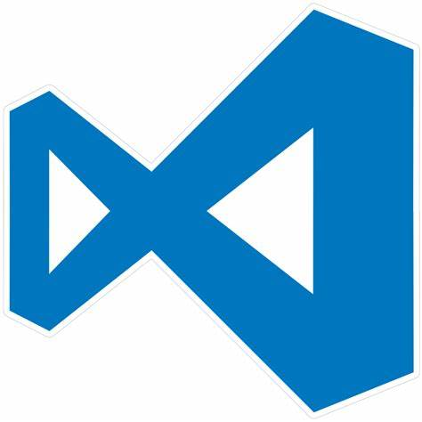

<!-- _backgroundImage: url('./img/hero-background.svg') -->

# **Linguagem de Programação**

 
 
 

Material, ferramentas e assuntos relacionados.

---

# **Whoami**
## Itor Isaias

- <i class="fa-brands fa-linkedin"></i> LinkedIn: - [itorisaias](https://www.linkedin.com/in/itorisaias/)
- <i class="fa-brands fa-github"></i> GitHub: [itorisaias](https://github.com/itorisaias)

---

# **Material**

Todo conteúdo será disponibilizado previamente no teams, e todas as listas e atividades após correção em sala de aula, estarão disponível nos links a baixo:

- Teams
- [Github](https://github.com/itorisaias/fatectq-linguagem-de-programa-o)

---

# **Ferramentas**

- [CodeBlocks](https://codeforwin.org/c-programming/create-compile-run-c-program-using-codeblocks)

- [Visual Studio Code (VSCode)](https://www.freecodecamp.org/news/how-to-write-and-run-c-cpp-code-on-visual-studio-code/)

---

# **Avaliação**

- P1 (04/10) - Avaliação `8 pontos` **+** (Projeto) `2 pontos`
- P2 (06/12) - Avaliação `8 pontos` **+** (Projeto) `2 pontos`

## **Média final** = (P1 + P2) / 2

- #### Se (Média final >= 6 && Presença >= 75%)
  - Aprovado
- #### Senão
  - Reprovado

---

---

# **Recuperação**

- Recuperação (13/12) - Avaliação `10 pontos`
- Substituirá a menor nota (P1 ou P2)

 
 

## **Média final** = (P maior + R) / 2

---

