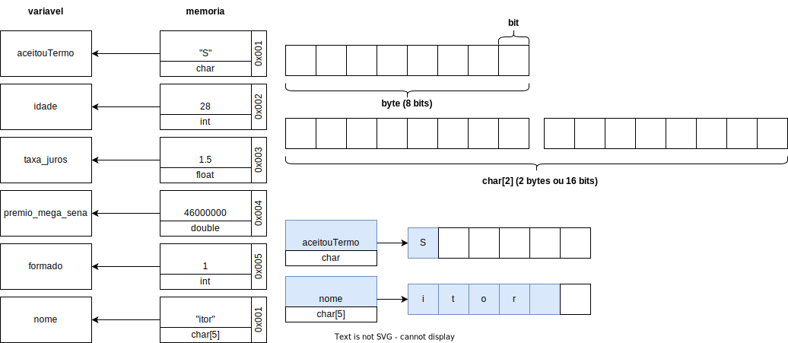

<!-- _backgroundImage: url('./img/hero-background.svg') -->


# **Linguagem de Programação**

Revisão.

---

# Agenda

- Variáveis, constantes e tipos de dados
- Palavras reservadas
- Entrada (`scanf` e `getch`) e saída (`printf`) de dados
- Operadores - Aritméticos: `+`, `-`, `*`, `/`, `%`, `++` e `--`
- Operadores - Lógicos: `&&`, `||` e `!`
- Operadores - Comparação: `==` `!=`, `>`, `<`, `<=` e `>=`
- Funções matemáticas
- Estruturas de Controle Condicional: `if`, `else`, `else if`,  `switch` e `case`
- Estruturas de Controle Repetição: `while`, `do while` e `for`

---


---


---

# Variáveis, constantes e tipos de dados

- Variáveis são espaços de memória reservados para armazenar valores.
- Os tipos de dados definem o tipo de valor que uma variável pode armazenar, como inteiros, ponto flutuante, caracteres, booleanos, entre outros.
- Exemplos de tipos de dados comuns incluem int (para números inteiros), float (para números decimais) e char (para caracteres).

---

# Variáveis, constantes e tipos de dados

[source](../atividades/03_Revisao/03_01_variaveis_constantes.c)
```c
// constante
#define PI 3.14
#define TRUE 1
#define FALSE 0
#define faculdade 'fatec taquaritinga'

void main() {
  // variáveis
  int idade = 28;
  float taxa_juros = 1.5;
  double premio_mega_sena = 46000000;
  char aceitouTermo = 'S';
  char nome[5] = "itor";
  int formado = TRUE;
}
```

---

# Variáveis, constantes e tipos de dados

#### Tabela - Tipos de dados

|Tipo|Faixa de valores|Tamanho (aproximado)|
|---|---|---|
|char|-127 a 127|8 bits|
|unsigned char|0 a 255|8 bits|
|int|-32.768 a 32.767|16 bits|
|unsigned int|0 a 65.535|16 bits|
|float|3.4x10^-38 a 3.4x10^38|32 bits|
|double|1.7x10^-308 a 1.7x10^308|64 bits|

---



---

# Palavras reservadas


---


---

# Entrada e saída de dados

- Funções de saída (output)
- Funções de entrada (input)
- Todas estão na biblioteca stdio (#include <stdio.h>)

---

# Entrada e saída de dados

#### **Saida**

[source](../atividades/03_Revisao/03_02_saida.c)
```c
#include <stdio.h> // carregamento da biblioteca stdio

int main() {
  int idade = 28;
  float taxa_juros = 1.5;
  char aceitouTermo = 'S';
  char nome[5] = "itor";

  printf("Hello World\n"); // output sem parâmetro
  printf("Usuario aceitou o termo? %c \n", aceitouTermo); // output com parâmetro do tipo char
  printf("Nome do usuario? %s\n", nome); // output com parâmetro do tipo char
  printf("Idade: %d\n", idade); // output com parâmetro do tipo int
  printf("Taxa de juros: %f\n", taxa_juros); // output com parâmetro do tipo float
  printf("Taxa de juros: %.2f\n", taxa_juros); // output com parâmetro do tipo float formatado
  printf("Taxa de juros: %.1f\n", taxa_juros); // output com parâmetro do tipo float formatado

  return 0;
}
```

---

# Entrada e saída de dados

#### **Entrada**

- `scanf` : É utilizada para fazer a leitura de dados formatados via teclado.

#### Exemplo

[source](../atividades/03_Revisao/03_02_entrada.c)
```c
#include <stdio.h>

int main() {
  int n; // Inicializa a variável do tipo int

  printf("Digite um número: "); // Imprimi na tela a frase "Digite um número: "
  scanf("%d", &n); // Aguardo usuário realizar a digitação do numero no teclado

  printf("O valor digitado foi %d\n",n); // Imprimi na tela a frase "O valor digitado foi X"

  return 0;
}
```

---

# Entrada e saída de dados

#### Tabela - Tipos de dados básicos e representação

|Tipo|Formato|Tipos de dados|
|---|---|---|
|int|%d|inteiro|
|float|%f|real|
|char|%c|caractere|
|char[]|%s|cadeia de caracteres (string)|

---


---

# Operadores

- Operadores são símbolos que realizam operações em variáveis e valores.
  - Aritméticos: adição (`+`), subtração (`-`), multiplicação (`*`), divisão (`/`), módulo (`%`), incremento (`++`) e decremento (`--`).
  - Lógicos: AND (`&&`), OR (`||`) e NOT (`!`).
  - Relacionais (ou de comparação): igualdade (`==`), desigualdade (`!=`), maior que (`>`), menor que (`<`), maior ou igual (`>=`) e menor ou igual (`<=`).

---

# Operadores - Aritméticos

[source](../atividades/03_Revisao/03_03_operador_aritmeticos.c)
```c
#include <stdio.h>

int main(void) {
  int a = 5, b = 3;

  int soma = a + b;
  printf("soma de %d e %d é %d\n", a, b, soma);

  int subtracao = a - b;
  printf("subtracao de %d e %d é %d\n", a, b, subtracao);

  int mult = a * b;
  printf("multiplicação de %d e %d é %d\n", a, b, mult);

  int divisao = a / b;
  printf("divisao de %d e %d é %d\n", a, b, divisao);

  int mod = a % b;
  printf("resto da divisão de %d e %d é %d\n", a, b, mod);

  a++;
  printf("incremento: %d\n", a);

  b--;
  printf("decremento: %d\n", b);

  return 0;
}
```

---

# Operadores - Lógicos

[source](../atividades/03_Revisao/03_03_operador_logico.c)
```c
#include <stdio.h>

int main(void) {
  int a = 1, b = 1;

  // AND (E)
  int resultado = (a && b);
  printf("%d && %d é %d\n", a, b, resultado);

  // OR (OU)
  resultado = (a || b);
  printf("%d || %d é %d\n", a, b, resultado);

  // NOT (NÃO)
  resultado = !a;
  printf("!%d é %d\n", a, resultado);

  // Combinação de operadores lógicos
  resultado = (a && b) || !a;
  printf("(%d && %d) || !%d é %d\n", a, b, a, resultado);

  return 0;
}
```

---

# Operadores - Relacionais

[source](../atividades/03_Revisao/03_03_operador_relacionais.c)
```c
#include <stdio.h>

int main(void) {
  int a = 5, b = 3;

  // Igualdade
  int resultado = (a == b);
  printf("%d == %d é %d\n", a, b, resultado);

  // Diferença
  resultado = (a != b);
  printf("%d != %d é %d\n", a, b, resultado);

  // Maior
  resultado = (a > b);
  printf("%d > %d é %d\n", a, b, resultado);

  // Menor
  resultado = (a < b);
  printf("%d < %d é %d\n", a, b, resultado);

  // Maior ou igual
  resultado = (a >= b);
  printf("%d >= %d é %d\n", a, b, resultado);

  // Menor ou Igual
  resultado = (a <= b);
  printf("%d <= %d é %d\n", a, b, resultado);

  return 0;
}
```

---

# Funções matemáticas


---


---

# Estruturas de Controle

- As estruturas de controle permitem que um programa tome decisões e repita ações com base em condições.
- O comando if-else permite que um programa execute certas instruções se uma condição for verdadeira e outras instruções se a condição for falsa.
- Os loops, como while e for, permitem que um programa execute um bloco de código repetidamente enquanto uma condição específica for verdadeira.

---

# Estruturas de Controle - Condicional

#### Pseudocódigo:

```
Inicio
  Se (condicao) então
    Instruções;
    Se (sub-condicao) então
      Sub-Instruções;
  Senão
    Instruções;
Fim
```

---

# Estruturas de Controle - Condicional

## **IF**

#### Código em C

[source](../atividades/03_Revisao/03_04_condicional.c)
```c
#include <stdio.h>

int main(void) {
  int idade = 30; // Declarando e inicializando a variável idade

  if (idade < 17) { // Testando a condição se é maior de idade
    printf("Você é menor de idade.\n");
  }

  return 0;
}
```

---

# Estruturas de Controle - Condicional

## **ELSE**

#### Código em C

[source](../atividades/03_Revisao/03_04_condicional_else.c)
```c
#include <stdio.h>

int main() {
  int idade = 30; // Declarando e inicializando a variável idade

  if (idade < 18) { // Testando a condição se é maior de idade
    printf("Você é menor de idade.\n");
  } else { // Senão não é um adulto
    printf("Você é maior de idade.\n");
  }

  return 0;
}
```

---

# Estruturas de Controle - Condicional

## **ELSE IF**

#### Código em C

[source](../atividades/03_Revisao/03_04_condicional_else_if.c)
```c
#include <stdio.h>

int main() {
  int idade = 30; // Declarando e inicializando a variável idade

  if (idade < 18) { // Testando a condição se é maior de idade
    printf("Você é menor de idade.\n");
  } else if (idade >= 18 && idade <= 30) { // Testando a condição se é maior ou igual à 18 E menor ou igual à 30
    printf("Você é jovem adulto.\n");
  } else { // Senão não é um adulto
    printf("Você é adulto.\n");
  }

  return 0;
}
```

---

# Estruturas de Controle - Repetição

## **WHILE**

- Verifica primeiro, executa depois;
- Repete somente enquanto <condição> = verdade;

#### Pseudocódigo:
```
Iniciar a variável de controle

Enquanto (condição) faça
  Instruções;
```

---

# Estruturas de Controle - Repetição

## **WHILE**

#### Código em C

[source](../atividades/03_Revisao/03_05_while.c)
```c
#include <stdio.h>

int main() {
  int contador = 0; // Declarando e inicializando a variável de controle

  while (contador <= 10) { // Testando a condição
    printf("%d ", contador); // Executando um comando dentro do laço
    contador++; // Atualizando a variável de controle
  }

  return 0;
}
```

---

# Estruturas de Controle - Repetição

## **DO WHILE**

- Executa primeiro, verifica depois:
- Repete somente enquanto <condição> = verdadeira;

#### Pseudocódigo:

```
Iniciar a variável de controle

Faca
  Instruções;
Enquanto (condição)
```

---

# Estruturas de Controle - Repetição

## **DO WHILE**

#### Código em C

[source](../atividades/03_Revisao/03_05_do_while.c)
```c
#include <stdio.h>

int main() {
  int contador = 0; // Declarando e inicializando a variável de controle

  do {
    printf("%d ", contador); // Executando um comando dentro do laço
    contador++; // Atualizando a variável de controle
  } while (contador <= 10); // Testando a condição

  return 0;
}
```

---

# Estruturas de Controle - Repetição

## **FOR**

- Repetição condicionada a uma contagem;
- Não precisa de variável de controle para o número de execuções;
- A própria estrutura gerencia o incremento da quantidade de execuções;

#### Pseudocódigo:

```
Para (valor inicial até condição_final passo n) faça
  Instruções;
```

```
for (valor_inicial; condição_final; valor_incremento) {
  instruções;
}
```

---

# Estruturas de Controle - Repetição

## **FOR**

#### Código em C:

[source](../atividades/03_Revisao/03_05_for.c)
```c
#include <stdio.h>

int main() {
  int quantidade = 10;

  for (int i = 0; i < quantidade; i++) {
    printf("%d ", i);
  }

  return 0;
}
```

---


---

# Interpretação - Ideal X Real

---

# Ideal - Conversor de Moeda

**Objetivo:**
O objetivo desta atividade é criar um programa em C que permita aos usuários converter um determinado valor em reais brasileiros (BRL) para dólares americanos (USD), utilizando a cotação do dólar fornecida pelo usuário.

**Instruções:**
1. O programa deve solicitar ao usuário que insira a cotação atual do dólar americano (USD).
2. Em seguida, o programa deve solicitar ao usuário que insira o valor em reais brasileiros (BRL) que deseja converter.
3. Com base na cotação fornecida pelo usuário, o programa deve calcular o valor equivalente em dólares americanos (USD).
4. Por fim, o programa deve exibir o valor em reais (BRL) e o valor equivalente em dólares (USD).

---

# Real - Conversor de Moeda

Criar um programa em C que converta um valor em reais (BRL) para dólares (USD), usando a cotação do dólar informada pelo usuário.

---


---

# Codificando juntos

---

# Exercícios

Serão **10 exercícios** relacionados aos conteúdos que irão cair na prova.

---

1. Criar um programa em C que converta um valor em reais (BRL) para dólares (USD), usando a cotação do dólar informada pelo usuário.
2. Faça um programa em C que leia o salário de um funcionário e calcule o desconto de INSS dada a tabela a seguir:

    |Salário de contribuição|Alíquota|
    |---|---|
    |até R$ 1.212,00|7,5%|
    |R$ 1.212,01 até R$2.427,35|9%|
    |R$ 2.427,36 até R$3.641,03|12%|
    |R$ 3.641,04 até R$7.087,22|14%|
    |acima R$7.087,22|R$828,39|

---

3. Faça um programa em C que mostre a tabuada de qualquer número escolhido pelo usuário (considerar tabuada do número 1 ao 10).
4. Faça um programa em C (com a estrutura do...while) que leia 5 valores inteiros e:
   1. Encontre e mostre o maior valor;
   2. Encontre e mostre o menor valor;
   3. Calcule e mostre a média dos números lidos;
5. Faça um programa em C (utilize a estrutura for) que leia 5 valores inteiros e:
   1. Encontre e mostre o maior valor
   2. Encontre e mostre o menor valor
   3. Calcule e mostre a média dos números lidos

---

6. Faça um programa em C que exiba na tela os números ímpares entre 100 e 300.
7. Faça um programa em C que receba um número inteiro e positivo, e diga se esse número é primo ou não. Obs: Um número é primo somente quando for divisível por 1 e por ele mesmo.
8. Faça um programa em C que receba a idade de 5 pessoas e mostre quantas são maiores que 18 anos.

---

9. A prefeitura de uma cidade fez uma pesquisa com 5 pessoas, coletando dados sobre o salário e o número de filhos. A prefeitura deseja saber:
   1.  A média do salário dessas pessoas
   2.  A média do número de filhos
   3.  O maior salário
   4.  A percentagem de pessoas com salários até R$ 150,00
10. Faça um programa em C que exiba na tela os números primos entre 0 até o numero informado pelo usuário.*

---

# Próximos passos

## **Funções (Reutilização de Código, Organização do Código, Abstração)**

```c
#include <stdio.h>

float calcularMedia(float num1, float num2, float num3) { // Função para calcular a média de três números
  return (num1 + num2 + num3) / 3.0;
}
int main() {
  float num1, num2, num3;
  printf("Digite o primeiro número: ");
  scanf("%f", &num1);
  printf("Digite o segundo número: ");
  scanf("%f", &num2);
  printf("Digite o terceiro número: ");
  scanf("%f", &num3);
  float media = calcularMedia(num1, num2, num3); // Calcula a média dos números usando a função calcularMedia
  printf("A média dos números é: %.2f\n", media); // Exibe a média calculada na tela
  return 0;
}
```

---

# Próximos passos

## **Vetor (array unidimensional, coleção de elementos)**

```c
#include <stdio.h>

int main() {
  int vetor[5] = {1, 2, 3, 4, 5}; // Declaração e inicialização de um vetor com 5 elementos

  printf("Elementos do vetor:\n"); // Exibindo os elementos do vetor
  for (int i = 0; i < 5; i++) {
    printf("%d ", vetor[i]);
  }
  printf("\n");
  return 0;
}
```

---

# Próximos passos

## **Matriz (estrutura bidimensional, linhas e colunas)**

```c
#include <stdio.h>

int main() {
  // Declaração e inicialização de uma matriz 2x3
  int matriz[2][3] = {
    {1, 2, 3},
    {4, 5, 6}
  };

  // Exibindo os elementos da matriz
  printf("Elementos da matriz:\n");
  for (int i = 0; i < 2; i++) {
    for (int j = 0; j < 3; j++) {
      printf("%d ", matriz[i][j]);
    }
    printf("\n");
  }

  return 0;
}

```

---


---

# Referencia

- [Documentação Bibliotecas em C](https://petbcc.ufscar.br/assert/)
- [Fundamentos da programação de computadores](https://archive.org/details/fundamentos-da-programacao-de-computadores-algoritmos-pascal-c-c-padrao-ansi-e-java-pdfdrive)
