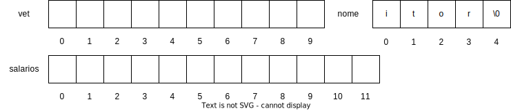
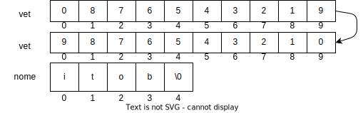
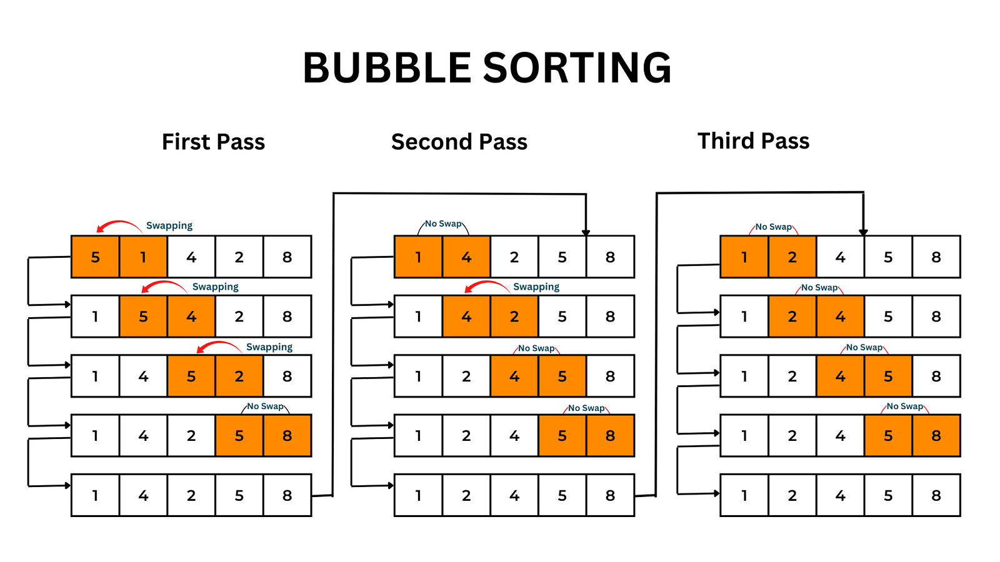

<!-- _backgroundImage: url('./img/hero-background.svg') -->


# **Linguagem de Programação**

Vetores.

---

# Agenda

- Definição
- Declaração
- Exemplos de vetor
- Atribuindo valores ao vetor
- Preenchendo um vetor
- Mostrando os elementos do vetor
- Exercícios

---

# Definição

- **Vetores:** Em C/C++, vetores são estruturas de dados capazes de armazenar múltiplos valores sob um único nome. Cada valor é acessado através de um índice.
- **Índices de Vetores:** Os índices em C/C++ são usados para identificar as posições dos elementos em um vetor. Eles começam em 0 e vão até o tamanho do vetor menos um.

---

# Declaração

- **Declaração de Vetores:** Os vetores são declarados colocando colchetes após o nome da variável. Dentro dos colchetes, especificamos o número de elementos que o vetor pode armazenar.

- **Tamanho do Vetor:** O tamanho do vetor deve ser um valor inteiro fixo, representado por um literal ou uma constante. Se for necessário definir o tamanho do vetor em tempo de execução, é necessário utilizar ponteiros, o que será abordado juntamente com funções.

---

# Exemplos de vetor

```c
#define MESES 12
void main() {
  int vet[10];
  double salarios[MESES];
  char nome[5] = "itor";
}
```

> Para char, definir uma posição a mais que a necessária, pois esta armazenará a marca de finalização de cadeia, representada pelo caractere "\0".



---

# Atribuindo valores ao vetor

- As atribuições em vetor exigem que seja informada em qual de suas posições o valor ficará armazenado.

```c
void main() {
  int vet[10] = {0, 8, 7, 6, 5, 4, 3, 2, 1, 9};
  char nome[5] = "itor";

  vet[0] = 9; // Atribui o valor `9` à primeira posição do vetor.
  vet[9] = 0; // Atribui o valor `0` à sétima posição do vetor.
  nome[3] = 'b'; // Atribui a letra `b` à quarta posição do vetor.
}
```



---

# Preenchendo um vetor

```c
#include <stdio.h>
void main() {
  int vetor[10];
  for (int i=0; i<10; i++)
    scanf("%d", &vetor[i]);
}
```

Nesse exemplo, a estrutura de repetição `for` foi utilizada para garantir que a variável `i` assumisse todos os valores possíveis para o índice do vetor (de O a 9). Assim, para cada execução da repetição, será utilizada uma posição diferente do vetor.

---

# Mostrando os elementos do vetor

```c
#include <stdio.h>
void main() {
  int vetor[10];
  for (int i=0; i < 10; i++)
    scanf("%d", &vetor[i]);
  for (int i=0; i < 10; i++)
    printf("%d ", vetor[i]);
}
```

Nesse exemplo, a estrutura de repetição `for` foi utilizada para garantir que a variável `i` assumisse todos os valores possíveis para o índice do vetor (de O a 9). Assim, para cada execução da repetição, foi utilizada uma posição diferente e, dessa forma, todos os valores do vetor foram mostrados.

---


---


---

# Exercícios

---

# Ordenação Bubble Sorting

<div class="columns">
  
  
</div>

---

# Algorítimos de ordenação

- Bubble Sort
- Selection Sort
- Insertion Sort
- ...

Mais referencias:
- https://imsouza.github.io/posts/algoritmos-de-ordenacao-em-c-1
- https://terminaldeinformacao.com/2013/05/10/ordenando-vetores-usando-linguagem-c/
- https://www.devmedia.com.br/algoritmos-de-ordenacao-analise-e-comparacao/28261

---


---

# Lista


[Lista](https://github.com/itorisaias/Fatectq-linguagem-de-programacao/blob/main/atividades/04_Vetores/Lista.pdf)

---

# Referência

- [Fundamentos da programação de computadores](https://archive.org/details/fundamentos-da-programacao-de-computadores-algoritmos-pascal-c-c-padrao-ansi-e-java-pdfdrive)
