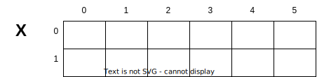

<!-- _backgroundImage: url('./img/hero-background.svg') -->


# **Linguagem de Programação**

Matris.

---

# Agenda

- Definição
- Declaração
- Exemplos
- Atribuindo valores
- Preenchendo
- Mostrando os elementos
- Exercícios

---

# Definição

- Uma matriz em C/C++ é um conjunto de variáveis do mesmo tipo identificadas pelo mesmo nome, diferenciadas por suas posições.
- Pode ter até 12 dimensões, mas as mais comuns têm duas.
- Os índices começam em 0 e vão até o tamanho da dimensão menos um, representados por tipos inteiros.

---

# Declaração
```
  tipo_dos_dados nome_variável [dimensãol][dimensão2][...][dimensãoN];
```

onde:
- `tipo_dos_dados`: é o tipo dos dados que serão armazenados na matriz;
- `nome_variável`: é o nome dado à variável do tipo matriz;
- `[dimensão1]`: representa o tamanho da 1º dimensão da matriz;
- `[dimensão2]`: representa o tamanho da 2º dimensão da matriz;
- `[dimensãoN]`: representa o tamanho da n-ésima dimensão da matriz.

Em C/C++, o tamanho das dimensões de uma matriz é indicado por um valor inteiro fixo, enquanto para definir o tamanho do vetor em tempo de execução, é necessário usar ponteiros.

---

# Exemplo 1

Da mesma maneira como ocorre com os vetores, os índices das dimensões das matrizes começam sempre em 0.

```c
float X[2][6];
```

Na declaração do exemplo 1, criou-se uma variável chamada X contendo duas linhas (de 0 a 1) com seis colunas cada (de 0 a 5), capaz de armazenar números reais, como pode ser observado a seguir.



---

# Exemplo 2

```c
char MAT[4][3];
```

A declaração do exemplo 2 criou uma variável chamada MAT contendo quatro linhas (de 0 a 3) com três colunas cada (de 0 a 2), capaz de armazenar caracteres, como pode ser observado a seguir.


---

# Exemplo 3

```c
float Y[2][4][3];
```

A declaração do exemplo 3 criou uma variável chamada Y contendo duas linhas (de 0 a 1) com quatro colunas cada (de 0 a 3) e profundidade três (de 0 a 2), capaz de armazenar números reais, como pode ser observado a seguir.


---

# Atribuindo valores - Exemplo 1

Atribuir valor a uma matriz significa armazenar informação em seus elementos, identificados de forma única por meio de seus índices.

```c
X[1][4] = 5;
```

Atribui o valor 5 à posição identificada pelos índices 1 (2º linha) e 4 (5º coluna).


---

# Atribuindo valores - Exemplo 2

```c
MAT[3][2] = "D";
```

Atribui a letra D à posição identificada pelos índices 3 (4º linha) e 2 (3º coluna).


---

# Atribuindo valores - Exemplo 3

```c
Y[0][3][1] = 12;
```

Atribui o valor 12 à posição identificada pelos índices 0 (1º linha), 3 (4º coluna) e 1 (2º profundidade).


---

# Preenchendo

Preencher uma matriz envolve percorrer todos os seus elementos e atribuir-lhes valores, seja fornecido pelo usuário através do teclado ou gerado pelo programa, como exemplificado na iteração por todos os elementos de uma matriz bidimensional, recebendo valores do usuário com scanf.

```c
for (int i = 0; i < 2; i++)
  for (int j = 0; j < 6; j++)
    scanf("%f", &X[i][j]);
```

---

# Mostrando os elementos

Para acessar e exibir os valores armazenados em uma matriz, como por exemplo uma matriz float de dimensões 2x6 declarada como X[2][6], podem-se utilizar os comandos a seguir.

```c
for (int i = 0; i < 2; i++)
  for (int j = 0; j < 6; j++)
    prinft("%f", &X[i][j]);
```

---

# Mostrando os elementos

## **Linha X Coluna**


## **Coluna X Linha**


---


---

# Exercícios

---

# Lista

[Link](https://github.com/itorisaias/Fatectq-linguagem-de-programacao/blob/main/atividades/05_Matris/Lista.pdf)

---

# Referência

- [Fundamentos da programação de computadores](https://archive.org/details/fundamentos-da-programacao-de-computadores-algoritmos-pascal-c-c-padrao-ansi-e-java-pdfdrive)
