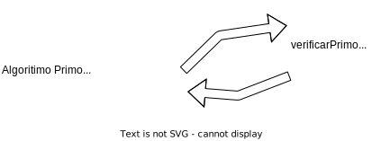
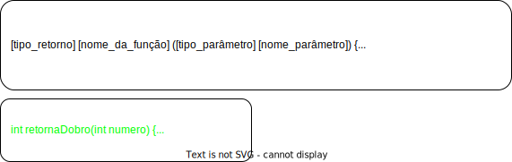
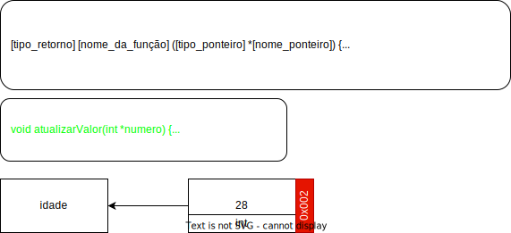

<!-- _backgroundImage: url('./img/hero-background.svg') -->


# **Linguagem de Programação**

Funções e procedimentos.

---

# Agenda

- Introdução às funções
- Função por valor
- Função por referência
- Comparação entre passagem por valor e por referência

---


---

# Introdução às Funções

**O que são funções em programação.**
  - Funções em programação são um conjunto de instruções que realizam uma tarefa específica.

**Por que as funções são importantes.**
  - Podem ser chamadas por outros programas ou por elas mesmas (recursão).
  - Podem receber e retornar valores.
  - Facilitam a reutilização e a leitura do código.

---

atualizar imagem de exemplo


---

# Função VS Procedimentos

- Função **retornam** resultado.
```c
int dobro(int n) {
  return n * 2;
}
```
- Procedimento **não retornam** resultado.
```c
void digaOla() {
  printf("Ola\n");
}
```

---

# Parâmetros

Funções podem receber 0 ou N parâmetros;
Funções sempre tem um tipo de retorno;
Todos os parâmetros devem ter um tipo;
```c
void zeroParametro(){ ... } // Função com zero parâmetro
void umParametro(int n) { ... } // Função com 1 parâmetro
void nParametro(int n1, int n2, int n3, int n4) { ... } // Função com 4 parâmetros
```

---

# Funções - Valor



---

# Desafio

Faça um programa em C, que dado um valor imprima 'Sim' se for par ou 'Nao' caso não seja, além de apresentar a tabuada do mesmo.

---

# Código

```c
#include <stdio.h>
int main() {
  int numero;
  scanf("%d", &numero);
  if (numero % 2 == 0)
    printf("Sim");
  else
    printf("Nao");
  for (int i = 1; i <= 10; i++)
    printf("%d x %d = %d", i, numero, i * numero);
  return 0;
}
```

---

# Refatorando

```c
#include <stdio.h>
int ehPar(int num) {
  return num % 2;
}
void imprimirTabuada(int num) {
  for (int i = 1; i <= 10; i++)
    printf("%d x %d = %d", i, num, i * num);
}
int main() {
  int numero;
  scanf("%d", &numero);
  if (ehPar(numero))
    printf("Sim");
  else
    printf("Nao");
  imprimirTabuada(numero);
  return 0;
}
```

---


---

# Funções - Referência (ponteiro)



---

# Ponteiro

**O que é um ponteiro**: Um ponteiro é uma _variável_ que armazena o **endereço de memória** de **outra variável**. Ele **"aponta"** para a localização onde um valor está armazenado na **memória**.
**Declarando um ponteiro**: Você declara um ponteiro colocando um asterisco (*) antes do nome da variável. (`int *ptr`)
**Ampersand (&) - Operador de endereço**: O operador `&` é usado para **obter** o **endereço de memória** de uma variável.
**Asterisco (\*) - Operador de desreferência**: O operador `*` é usado para **acessar** o **valor** armazenado no endereço apontado por um ponteiro.

---

# Desafio

Faça um programa em C, que receba 2 valores e troque os valores entre eles (A -> B) (B -> A), a função main deve ter no máximo 4 linhas.

**Saida esperada**
Valores antes da troca: a = 5, b = 12
Valores depois da troca: a = 12, b = 5

---

# Código

😢 Não conseguimos

```c
#include <stdio.h>

void main() {
  int a = 5, b = 10;
  printf("Valores antes da troca: a = %d, b = %d\n", a, b);
  int temp = a;
  a = b;
  b = temp;
  printf("Valores depois da troca: a = %d, b = %d\n", a, b);
}
```

---

# Refatorando

```c
#include <stdio.h>
void mudarValores(int *ptr1, int *ptr2) {
  int temp = *ptr1; // *ptr1 realiza a leitura do valor no ponteiro
  *ptr1 = *ptr2; // *ptr1 = atualiza o valor do ponteiro
  *ptr2 = temp;
}
void main() {
  int a = 5, b = 10;
  printf("Valores antes da troca: a = %d, b = %d\n", a, b);
  mudarValores(&a, &b);
  printf("Valores depois da troca: a = %d, b = %d\n", a, b);
}
```

---

# Comparação entre passagem por valor e por referência

**Valor**
- Cópia dos dados
- Segurança, Previsibilidade e Simplicidade

**Referência**
- Eficiência de memória e Desempenho
- Capacidade de modificar argumentos
- Complexidade adicional
- Riscos de modificação acidental

---

# Relembrando

Já utilizamos varias funções prontas como:

- `prinft`, `scanf` de `stdio.h`
- `log`, `sqrt` de `math.h`
- `system`, `qsort` de `stdlib.h`

---

# Deixando o código mais limpo

Uma dica útil para tornar nossos códigos mais limpos é declarar a função antes da função principal (main) e implementá-la posteriormente. Isso contribui para uma leitura mais fluente e compreensível do código.

```c
#include<stdio.h>
int soma(int a, int b);
void main() {
  int n1 = 5, n2 = 4;
  printf("Soma dos valores %d e %d é %d\n", n1, n2, soma(n1, n2));
}
int soma(int a, int b) {
  return a + b;
}
```

---

# Indo além

Podemos também importar funções prontas de outros arquivos.

arquivo_ola.c
```c
#include <stdio.h>
void digaOla() {
  printf("Olá\n");
}
```

arquivo.c
```c
#include "C:\arquivo_ola.c"
void main() {
  digaOla();
}
```

---

# Indo além

Desenvolva um programa que exiba os valores de N de forma decrescente até 0, sem o uso de estruturas de repetição, e em seguida adapte-o para que os valores sejam exibidos em ordem crescente.


---


---

# Começando Lista de Funções

Refaça a lista 03 (matriz) utilizando funções.

---

# Referências

- [Fundamentos da programação de computadores](https://archive.org/details/fundamentos-da-programacao-de-computadores-algoritmos-pascal-c-c-padrao-ansi-e-java-pdfdrive)

- [Visualize code](https://pythontutor.com/render.html#mode=display)
