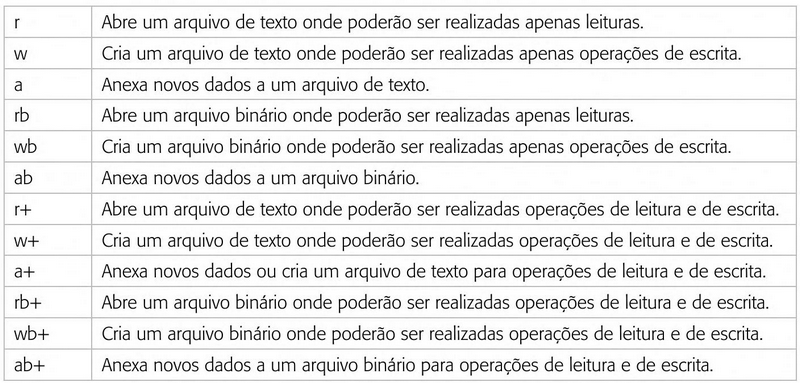

<!-- _backgroundImage: url('./img/hero-background.svg') -->


# **Linguagem de Programação**

Introdução à Manipulação de Arquivos.

---

# Agenda

1. Introdução aos Arquivos
2. Tipos de Arquivos
3. Operações Básicas com Arquivos
4. Leitura e Escrita de Arquivos de Texto
5. Manipulação de Arquivos Binários
6. Exemplos Práticos e Exercícios
7. Conclusão e Próximos Passos

---

# Introdução aos Arquivos

**O que é um arquivo?**
- Um arquivo é uma coleção de dados armazenados em um dispositivo de armazenamento.
- Pode conter texto, imagens, áudio, vídeo, e outros tipos de dados.

---

# Tipos de Arquivos

- Arquivos de Texto
  - Contêm caracteres legíveis por humanos.
  - Exemplos: `.txt`, `.csv`.
- Arquivos Binários
  - Contêm dados em formato binário, não legível diretamente.
  - Exemplos: `.jpg`, `.exe`.

---

# Operações Básicas com Arquivos

1. Abrir um arquivo
2. Ler um arquivo
3. Escrever em um arquivo
4. Fechar um arquivo

---

# Leitura e Escrita de Arquivos de Texto

---

# Abrir e Fechar Arquivos

```c
#include <stdio.h>

void main() {
    FILE *file;
    file = fopen("exemplo.txt", "r"); // Abrir um arquivo para leitura

    if (file == NULL) { // Verificar se o arquivo foi aberto com sucesso
        printf("Erro ao abrir o arquivo.\n");
        return;
    }

    fclose(file); // Fechar o arquivo
}
```

> Se o arquivo não existir, ele será criado;
> Se o arquivo já existir, ele será sobreposto por um novo arquivo vazio

---

# Leitura de Arquivos de Texto

```c
#include <stdio.h>

void main() {
    FILE *file;
    char texto[256];

    file = fopen("exemplo.txt", "r"); // Abrir o arquivo para leitura

    if (file == NULL) { // Verificar se o arquivo foi aberto com sucesso
        printf("Erro ao abrir o arquivo.\n");
        return;
    }

    while (fgets(texto, 256, file) != NULL) { // Ler e imprimir o conteúdo do arquivo
        printf("%s", texto);
    }

    fclose(file); // Fechar o arquivo
}
```

---

# Escrita em Arquivos de Texto

```c
#include <stdio.h>

void main() {
    FILE *file;

    file = fopen("exemplo.txt", "w"); // Abrir um arquivo para escrita

    if (file == NULL) { // Verificar se o arquivo foi aberto com sucesso
        printf("Erro ao abrir o arquivo.\n");
        return;
    }

    fprintf(file, "Olá, Mundo!\n"); // Escrever no arquivo
    fprintf(file, "Aprendendo manipulação de arquivos em C.\n");

    fclose(file); // Fechar o arquivo
}
```

---

# Adicionar Dados em Arquivos de Texto

```c
#include <stdio.h>

void main() {
    FILE *file;

    file = fopen("exemplo.txt", "a"); // Abrir um arquivo para adicionar conteúdo

    if (file == NULL) { // Verificar se o arquivo foi aberto com sucesso
        printf("Erro ao abrir o arquivo.\n");
        return;
    }

    fprintf(file, "Adicionando uma nova linha.\n"); // Adicionar conteúdo ao arquivo

    fclose(file); // Fechar o arquivo
}
```

---

# Manipulação de Arquivos Binários

---

# Escrita em Arquivos Binários

```c
#include <stdio.h>

typedef struct {
    char nome[100];
    int idade;
} Pessoa;

void main() {
    FILE *file;
    Pessoa pessoa = {"Itor Isaias", 28};

    file = fopen("exemplo.bin", "wb"); // Abrir um arquivo binário para escrita

    if (file == NULL) { // Verificar se o arquivo foi aberto com sucesso
        printf("Erro ao abrir o arquivo.\n");
        return;
    }

    fwrite(&pessoa, sizeof(Pessoa), 1, file); // Escrever no arquivo (variavel, tamanho da estrutura, quantidade e vezes, arquivo)

    fclose(file); // Fechar o arquivo
}
```

---

# Leitura de Arquivos Binários

```c
#include <stdio.h>

typedef struct {
    char nome[100];
    int idade;
} Pessoa;

void main() {
    FILE *file;
    Pessoa pessoa;

    file = fopen("exemplo.bin", "rb"); // Abrir um arquivo binário para leitura

    if (file == NULL) { // Verificar se o arquivo foi aberto com sucesso
        printf("Erro ao abrir o arquivo.\n");
        return;
    }

    fread(&pessoa, sizeof(Pessoa), 1, file); // Ler o conteúdo binário

    printf("Nome: %s\n", pessoa.nome);
    printf("Idade: %d\n", pessoa.idade);

    fclose(file); // Fechar o arquivo
}
```

---

# Modo de abertura



---


---


---

# Exemplos Práticos e Exercícios

1. Crie um arquivo de texto que armazene uma lista de tarefas.
2. Escreva um programa que leia essa lista e exiba na tela.
3. Adicione a funcionalidade de adicionar novas tarefas ao arquivo.
4. Escreva um programa que leia e escreva dados binários representando informações de um produto (nome, preço, quantidade).

---

# Conclusão e Próximos Passos

**Conclusão:** Aprendemos como manipular arquivos de texto e binários em C.

**Próximos Passos:**

1. Manipulação avançada de arquivos.
2. Tratamento de erros e exceções.
3. Aplicações práticas e projetos.

---

# Referências

- [Fundamentos da programação de computadores](https://archive.org/details/fundamentos-da-programacao-de-computadores-algoritmos-pascal-c-c-padrao-ansi-e-java-pdfdrive)
